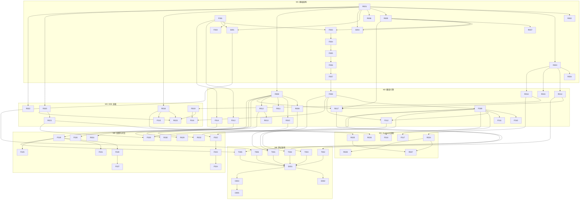

# Flutter Translate 开发任务拆解

> 生成日期：2026-04-24
> 更新日期：2026-05-08
> 关联文档：`需求文档.md`、`flutter-frontend-dev.md`、`rust-backend-dev.md`、`ffi-api-design.md`、`跨平台重构设计文档.md`、`跨平台重构任务拆解.md`
> 总工期：约 7 周（6 个里程碑）
> 状态：M1-M6 已完成；跨平台重构 P1-P4 已完成

---

## 1. 任务总览

| 阶段 | 内容 | 工期 | 任务数 | 交付物 |
|------|------|------|--------|--------|
| M1 | 项目搭建 + FFI 桥接 + 基础架构 | 1 周 | 12 | 可运行骨架、FFI 通、托盘基础 | 已完成 |
| M2 | 翻译引擎 + 配置管理 + 厂商接入 | 1.5 周 | 15 | 3+ 厂商可用、配置持久化 | 已完成 |
| M3 | KDE Plasma 适配 | 1 周 | 8 | KDE 下完整可用 | 已完成 |
| M4 | Hyprland 适配 | 1.5 周 | 8 | Hyprland 下完整可用 | 已完成 |
| M5 | 设置面板 + 厂商切换 + 对比面板 | 1 周 | 10 | 完整设置功能、厂商切换、对比翻译 | 已完成 |
| M6 | 优化 + 测试 + 打包发布 | 1 周 | 8 | 稳定版本、双平台验证 | 已完成 |
| 跨平台 | P1-P4 平台抽象层 + Win/macOS + CI/CD | ~7-8 周 | 46 | 支持 Linux/Windows/macOS 三平台 | 已完成 |

**总任务数：61 个（原始）+ 46 个（跨平台重构）**

---

## 0. 项目状态总览（2026-05-08 更新）

本项目原始里程碑 M1-M6（Linux Wayland 独占版本）已全部完成。后续进行了跨平台重构（P1-P4），将架构扩展为支持 Linux / Windows / macOS 三平台。

### 已完成里程碑

| 阶段 | 内容 | 状态 | 完成日期 |
|------|------|------|---------|
| M1 | 项目搭建 + FFI 桥接 + 基础架构 | 已完成 | 2026-04 |
| M2 | 翻译引擎 + 配置管理 + 厂商接入 | 已完成 | 2026-04 |
| M3 | KDE Plasma 适配 | 已完成 | 2026-04 |
| M4 | Hyprland 适配 | 已完成 | 2026-04 |
| M5 | 设置面板 + 厂商切换 + 对比面板 | 已完成 | 2026-04 |
| M6 | 优化 + 测试 + 打包发布 | 已完成 | 2026-04 |
| P1 | 平台抽象层重构（Linux 零回归） | 已完成 | 2026-05-08 |
| P2 | Windows 实现 | 已完成 | 2026-05-08 |
| P3 | macOS 实现（Universal Binary） | 已完成 | 2026-05-08 |
| P4 | Linux aarch64 + CI/CD 矩阵 | 核心完成 | 2026-05-08 |

### 跨平台重构关联文档

- `docs/跨平台重构设计文档.md` — 平台抽象层 trait 设计、各平台实现方案、CI/CD 矩阵
- `docs/跨平台重构任务拆解.md` — P1-P4 详细任务清单与状态跟踪

---

---

## 2. 任务详细清单

### M1：项目搭建 + FFI 桥接 + 基础架构（1 周）

#### 2.1 Rust 后端任务

| ID | 任务 | 优先级 | 预估 | 依赖 | 验收标准 |
|----|------|--------|------|------|---------|
| R001 | 创建 Rust 项目结构（native/） | P0 | 2h | 无 | `cargo build` 通过，模块目录完整 | 已完成 |
| R002 | 配置 Cargo.toml 依赖清单 | P0 | 1h | R001 | 所有依赖版本锁定，`cargo check` 通过 | 已完成 |
| R003 | 实现配置管理模块骨架（config/） | P0 | 4h | R001 | SQLite 初始化、表创建成功 | 已完成 |
| R004 | 实现桌面环境检测（detect_desktop_env） | P0 | 2h | R003 | 正确识别 KDE/Hyprland/Unknown | 已完成 |
| R005 | 实现 FFI 桥接层（ffi/） | P0 | 4h | R001,R003 | flutter_rust_bridge 配置完成，代码生成成功 | 已完成 |
| R006 | 实现错误类型定义（TranslateError/ConfigError 等） | P0 | 2h | R001 | 所有错误类型实现 thiserror | 已完成 |
| R007 | 实现共享类型定义（ProviderConfig/TranslationResult 等） | P0 | 3h | R005,R006 | 类型实现 Serialize/Deserialize/frb 标记 | 已完成 |

#### 2.2 Flutter 前端任务

| ID | 任务 | 优先级 | 预估 | 依赖 | 验收标准 |
|----|------|--------|------|------|---------|
| F001 | 创建 Flutter 项目结构 | P0 | 2h | 无 | `flutter create` 完成，目录结构符合设计 | 已完成 |
| F002 | 配置 pubspec.yaml 依赖清单 | P0 | 1h | F001 | 所有依赖版本锁定，`flutter pub get` 通过 | 已完成 |
| F003 | 配置 flutter_rust_bridge 集成 | P0 | 3h | F001,R005 | FFI 代码生成成功，Dart 端可调用 | 已完成 |
| F004 | 实现数据模型（freezed + json_serializable） | P0 | 4h | F003 | 所有模型生成 .freezed.dart/.g.dart | 已完成 |
| F005 | 实现错误类型定义（AppException/Failure） | P0 | 2h | F004 | 异常类型与 Rust 错误映射 | 已完成 |
| F006 | 实现 FFI 数据源封装（FfiDatasource） | P0 | 4h | F003,F005 | 所有 FFI 调用封装完成，异常转换正确 | 已完成 |
| F007 | 实现 Repository 层（Translation/Config/Session） | P0 | 3h | F006 | Repository 接口定义完成 | 已完成 |

#### 2.3 共享任务

| ID | 任务 | 优先级 | 预估 | 依赖 | 验收标准 | 状态 |
|----|------|--------|------|------|---------|------|
| S001 | 配置构建脚本（build.sh/gen_bridge.sh） | P0 | 2h | R001,F001 | 一键构建成功 | 已完成 |
| S002 | 配置开发环境（IDE 插件、代码格式化） | P0 | 1h | 无 | clippy/rustfmt/flutter_lints 配置完成 | 已完成 |
| S003 | 创建基础托盘服务（tray/） | P0 | 4h | R001,R005 | 托盘图标显示，右键菜单可点击 | 已完成 |

---

### M2：翻译引擎 + 配置管理 + 厂商接入（1.5 周）

#### 2.4 Rust 后端任务

| ID | 任务 | 优先级 | 预估 | 依赖 | 验收标准 |
|----|------|--------|------|------|---------|
| R008 | 实现 TranslateProvider trait | P0 | 3h | R001,R006 | trait 定义完整，包含 translate/test_connection/name | 已完成 |
| R009 | 实现 OpenAI 厂商（openai.rs） | P0 | 4h | R008 | Chat Completions API 调用成功 | 已完成 |
| R010 | 实现 DeepL 厂商（deepl.rs） | P0 | 3h | R008 | DeepL API v2 调用成功 | 已完成 |
| R011 | 实现 Google 厂商（google.rs） | P1 | 3h | R008 | Cloud Translation API 调用成功 | 已完成 |
| R012 | 实现请求路由器（router.rs） | P0 | 4h | R008,R003 | 单厂商路由正确，偏好缓存生效 | 已完成 |
| R013 | 实现并行翻译（translate_compare） | P1 | 4h | R012 | 多厂商并行请求，结果聚合正确 | 已完成 |
| R014 | 实现配置 CRUD（save/get/delete provider） | P0 | 4h | R003 | SQLite 读写正确，libsecret 加密存储 API Key | 已完成 |
| R015 | 实现会话管理（get/update session） | P0 | 2h | R003 | 会话状态持久化 | 已完成 |
| R016 | 实现快捷键配置 CRUD | P0 | 3h | R003 | 快捷键配置读写正确 | 已完成 |
| R017 | 实现 FFI 导出接口（translate/save_provider 等） | P0 | 4h | R005,R008,R014 | 所有 FFI 接口实现，Dart 端可调用 | 已完成 |

#### 2.5 Flutter 前端任务

| ID | 任务 | 优先级 | 预估 | 依赖 | 验收标准 | 状态 |
|----|------|--------|------|------|---------|------|
| F008 | 实现 Riverpod Provider（translation/config/session） | P0 | 4h | F007 | 状态管理完整，异步加载正确 | 已完成 |
| F009 | 实现浮动翻译窗口（FloatingPage） | P0 | 6h | F008 | 窗口无边框、置顶、可拖拽 | 已完成 |
| F010 | 实现翻译输入/结果面板 | P0 | 4h | F009 | 输入文本、显示结果、复制按钮 | 已完成 |
| F011 | 实现语言选择器（LanguageSwitcher） | P0 | 3h | F009 | 源/目标语言选择、互换按钮 | 已完成 |
| F012 | 实现厂商快捷切换器（ProviderSelector） | P0 | 4h | F008,F009 | 下拉列表显示厂商、点击切换 | 已完成 |
| F013 | 实现主题系统（light/dark） | P1 | 3h | F001 | 主题切换生效，跟随系统 | 已完成 |
| F014 | 实现路由配置（go_router） | P0 | 3h | F001 | 路由表完整，导航正确 | 已完成 |

---

### M3：KDE Plasma 适配（1 周）

#### 2.6 Rust 后端任务

| ID | 任务 | 优先级 | 预估 | 依赖 | 验收标准 |
|----|------|--------|------|------|---------|
| R018 | 实现 KDE 托盘服务（SNI 注册） | P0 | 4h | R001,R017 | 托盘图标在 KDE 显示，菜单正常 | 已完成 |
| R019 | 实现 KDE 快捷键注册（KGlobalAccel D-Bus） | P0 | 6h | R016 | 快捷键在 KDE 全局生效 | 已完成 |
| R020 | 实现 KDE 截图（xdg-desktop-portal-kde） | P0 | 6h | R001 | 截图成功返回图像数据 | 已完成 |
| R021 | 实现 OCR 服务（tesseract 集成） | P0 | 4h | R020 | 识别准确率高，支持多语言 | 已完成 |
| R022 | 实现剪贴板服务（wl-clipboard-rs） | P0 | 3h | R001 | 读写剪贴板文本正确 | 已完成 |
| R023 | 实现桌面适配器（DesktopAdapter for KDE） | P0 | 3h | R018,R019,R020 | 自动选择 KDE 实现 | 已完成 |

#### 2.7 Flutter 前端任务

| ID | 任务 | 优先级 | 预估 | 依赖 | 验收标准 | 状态 |
|----|------|--------|------|------|---------|------|
| F015 | 实现托盘菜单交互 | P0 | 3h | F009,R018 | 托盘菜单点击触发对应操作 | 已完成 |
| F016 | 实现快捷键监听（Rust Stream → Dart） | P0 | 4h | R019,F008 | 快捷键触发后窗口显示 | 已完成 |

---

### M4：Hyprland 适配（1.5 周）

#### 2.8 Rust 后端任务

| ID | 任务 | 优先级 | 预估 | 依赖 | 验收标准 |
|----|------|--------|------|------|---------|
| R024 | 实现 Hyprland 快捷键（evdev 监听） | P0 | 6h | R016 | 快捷键全局生效，不依赖 compositor | 已完成 |
| R025 | 实现 Hyprland 截图（grim + slurp） | P0 | 4h | R021 | 区域选择截图成功 | 已完成 |
| R026 | 实现 Hyprland 托盘检测（waybar 检测） | P1 | 2h | R018 | 检测 waybar 是否运行 | 已完成 |
| R027 | 实现桌面适配器（DesktopAdapter for Hyprland） | P0 | 3h | R024,R025 | 自动选择 Hyprland 实现 | 已完成 |
| R028 | 实现 evdev 备用快捷键（KDE 失败时回退） | P1 | 4h | R024 | 双方案自动切换 | 已完成 |

#### 2.9 Flutter 前端任务

| ID | 任务 | 优先级 | 预估 | 依赖 | 验收标准 | 状态 |
|----|------|--------|------|------|---------|------|
| F017 | 实现 Hyprland 窗口行为适配 | P0 | 3h | F009 | 窗口在 Hyprland 下正确浮动 | 已完成 |
| F018 | 实现桌面环境提示（首次运行引导） | P1 | 2h | F009 | 检测到桌面环境后提示用户 | 已完成 |

---

### M5：设置面板 + 厂商切换 + 对比面板（1 周）

#### 2.10 Flutter 前端任务

| ID | 任务 | 优先级 | 预估 | 依赖 | 验收标准 |
|----|------|--------|------|------|---------|
| F019 | 实现设置面板（SettingsPage） | P0 | 6h | F014 | TabBar 分组：厂商/快捷键/语言/外观 | 已完成 |
| F020 | 实现厂商配置表单（ProviderForm） | P0 | 6h | F019 | 添加/编辑/删除厂商，测试连接 | 已完成 |
| F021 | 实现快捷键编辑器（ShortcutEditor） | P0 | 4h | F019 | 录制快捷键、冲突检测、保存 | 已完成 |
| F022 | 实现多厂商对比面板（ComparePage） | P1 | 6h | F009,F012 | 多选厂商、并行请求、多栏布局 | 已完成 |
| F023 | 实现结果卡片（ResultCard） | P1 | 3h | F022 | 显示厂商名称、响应时间、译文 | 已完成 |
| F024 | 实现响应时间标注（ResponseTimeBadge） | P1 | 2h | F023 | 颜色区分快/中/慢 | 已完成 |
| F025 | 实现语言偏好设置 | P1 | 3h | F019 | 常用语言收藏、使用计数 | 已完成 |
| F026 | 实现主题选择器（ThemePicker） | P1 | 2h | F013 | 亮色/暗色/跟随系统 | 已完成 |
| F027 | 实现配置导入/导出 | P1 | 3h | F020 | JSON 文件导入导出配置 | 已完成 |
| F028 | 实现 OCR 翻译入口 | P0 | 4h | F009,R021 | 快捷键触发截图 → OCR → 翻译 | 已完成 |

#### 2.11 Rust 后端任务

| ID | 任务 | 优先级 | 预估 | 依赖 | 验收标准 | 状态 |
|----|------|--------|------|------|---------|------|
| R029 | 实现 Anthropic 厂商 | P1 | 3h | R008 | Messages API 调用成功 | 已完成 |
| R030 | 实现 Azure 厂商 | P1 | 3h | R008 | Azure OpenAI Service 适配 | 已完成 |
| R031 | 实现自定义厂商（OpenAI 兼容） | P1 | 3h | R008 | 自定义 URL/模型可用 | 已完成 |
| R032 | 实现请求限流（governor） | P1 | 3h | R012 | 防止 API 限流 | 已完成 |

---

### M6：优化 + 测试 + 打包发布（1 周）

#### 2.12 测试任务

| ID | 任务 | 优先级 | 预估 | 依赖 | 验收标准 |
|----|------|--------|------|------|---------|
| T001 | Rust 单元测试（翻译引擎） | P0 | 4h | R009,R010 | 覆盖率 ≥ 80% | 已完成 |
| T002 | Rust 单元测试（配置管理） | P0 | 3h | R014 | 覆盖率 ≥ 80% | 已完成 |
| T003 | Rust 集成测试（mock API） | P0 | 4h | R017 | mockito 模拟厂商响应 | 已完成 |
| T004 | Flutter 单元测试（Provider） | P0 | 4h | F008 | 覆盖率 ≥ 70% | 已完成 |
| T005 | Flutter Widget 测试 | P0 | 4h | F009,F019 | 核心组件渲染正确 | 已完成 |
| T006 | FFI 集成测试 | P0 | 4h | S001 | 端到端调用成功 | 已完成 |
| T007 | 性能基准测试 | P1 | 3h | 全部 | 响应时间/内存/CPU 达标 | 已完成 |

#### 2.13 发布任务

| ID | 任务 | 优先级 | 预估 | 依赖 | 验收标准 | 状态 |
|----|------|--------|------|------|---------|------|
| D001 | 配置 AppImage 打包 | P0 | 4h | 全部 | 单文件可执行 | 已完成 |
| D002 | 配置 Flatpak 打包（可选） | P1 | 6h | D001 | FlatHub 提交准备 | 待开始 |
| D003 | 编写安装文档 | P0 | 2h | D001 | README 包含安装步骤 | 已完成 |
| D004 | 编写用户手册 | P1 | 4h | 全部 | 功能说明、快捷键列表 | 已完成 |
| D005 | 创建 GitHub Release | P0 | 1h | D001 | 附带二进制和 changelog | 已完成 |

---

## 3. 依赖关系图



---

## 4. 跨平台重构任务（P1-P4）

跨平台重构的详细任务清单见 `docs/跨平台重构任务拆解.md`。以下为高阶汇总：

| 阶段 | 内容 | 状态 | 完成日期 |
|------|------|------|---------|
| P1 | 平台抽象层重构（Linux 零回归） | 已完成 | 2026-05-08 |
| P2 | Windows 实现（global-hotkey / arboard / xcap / tray-icon） | 已完成 | 2026-05-08 |
| P3 | macOS 实现（Universal Binary） | 已完成 | 2026-05-08 |
| P4 | Linux aarch64 + CI/CD 矩阵 | 核心完成 | 2026-05-08 |

**关键实现调整**：
- Windows 截图由设计文档中的 WGC API 改为 `xcap` crate，降低复杂度
- `PlatformBackend` trait 部分方法为同步签名，与 FFI bridge 调用方式匹配
- macOS 截图使用 `screencapture -i -x`（增加 `-x` 禁用音效）

---

## 5. 并行执行建议

### 4.1 可并行任务组

| 阶段 | 并行组 | 任务 | 说明 |
|------|--------|------|------|
| M1 | 前端骨架 | F001,F002,F004,F005 | 不依赖 Rust 端 |
| M1 | 后端骨架 | R001,R002,R003,R006 | 不依赖 Flutter 端 |
| M2 | 厂商实现 | R009,R010,R011 | 相互独立 |
| M2 | 前端页面 | F009,F010,F011 | 可并行开发 |
| M3 | KDE 服务 | R018,R020,R022 | 相互独立 |
| M4 | Hyprland 服务 | R024,R025 | 相互独立 |
| M5 | 设置组件 | F020,F021,F025,F026 | 相互独立 |
| M6 | 测试编写 | T001,T002,T004 | 可并行 |

### 4.2 关键路径

```
R001 → R003 → R005 → R017 → F006 → F007 → F008 → F009 → F019 → T005 → D001
```

**关键路径任务必须按顺序完成，其他任务可并行。**

---

## 5. 风险与缓解

| 风险 | 影响任务 | 概率 | 缓解措施 |
|------|---------|------|---------|
| flutter_rust_bridge 版本不兼容 | F003,R005,R017 | 中 | 锁定版本，提前验证 |
| KDE D-Bus 接口变化 | R019 | 低 | 使用 zbus 代码生成，适配多版本 |
| Hyprland 权限限制 | R024 | 中 | 提供 evdev 备用方案 |
| tesseract 识别率低 | R021 | 中 | 支持云端 OCR 备选 |
| Wayland 剪贴板权限 | R022 | 低 | 使用 wl-clipboard-rs 标准库 |
| 多厂商 API 限流 | R013,R032 | 中 | 实现请求限流和错峰 |

---

## 6. 任务状态跟踪

| ID | 任务 | 状态 | 负责人 | 开始日期 | 完成日期 | 备注 |
|----|------|------|--------|---------|---------|------|
| R001 | 创建 Rust 项目结构 | 已完成 | | 2026-04 | 2026-04 | |
| R002 | 配置 Cargo.toml | 已完成 | | 2026-04 | 2026-04 | |
| ... | （所有 M1-M6 任务已完成，详见上文详细清单） | 已完成 | | | | |

---

## 7. 完成总结

**2026-05-08 更新**：Waylex 原始开发里程碑 M1-M6 及跨平台重构 P1-P4 已全部完成。

### 7.1 原始里程碑完成情况

| 里程碑 | 内容 | 状态 | 关键交付物 |
|--------|------|------|-----------|
| M1 | 项目搭建 + FFI 桥接 + 基础架构 | 已完成 | 可运行骨架、托盘基础 |
| M2 | 翻译引擎 + 配置管理 + 厂商接入 | 已完成 | 10 家厂商、SQLite 配置持久化 |
| M3 | KDE Plasma 适配 | 已完成 | KGlobalAccel D-Bus 热键、SNI 托盘 |
| M4 | Hyprland 适配 | 已完成 | evdev 热键、grim+slurp 截图 |
| M5 | 设置面板 + 厂商切换 + 对比面板 | 已完成 | 完整设置、快捷键编辑、多厂商对比 |
| M6 | 优化 + 测试 + 打包发布 | 已完成 | AppImage 打包、CI 配置 |

### 7.2 跨平台重构完成情况

| 阶段 | 内容 | 状态 | 关键交付物 |
|------|------|------|-----------|
| P1 | 平台抽象层重构 | 已完成 | `PlatformBackend` trait、Linux 零回归 |
| P2 | Windows 实现 | 已完成 | `WindowsBackend`（xcap 截图） |
| P3 | macOS 实现 | 已完成 | `MacOsBackend`（Universal Binary） |
| P4 | CI/CD 矩阵 | 核心完成 | 5 发行版 CI、macOS lipo、AppImage |

### 7.3 剩余待办

- **D002** Flatpak 打包：设计文档已提供 manifest 参考，待实际测试和发布
- **S402/S403** aarch64 Docker 构建环境 / Flatpak manifest：详见 `跨平台重构任务拆解.md`

> 提示：建议使用项目管理工具（如 GitHub Projects、Linear）跟踪任务状态。
